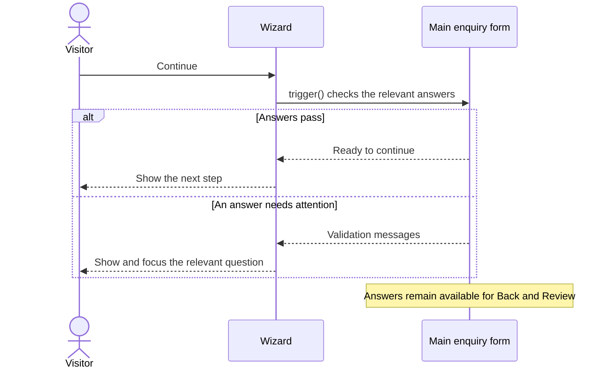
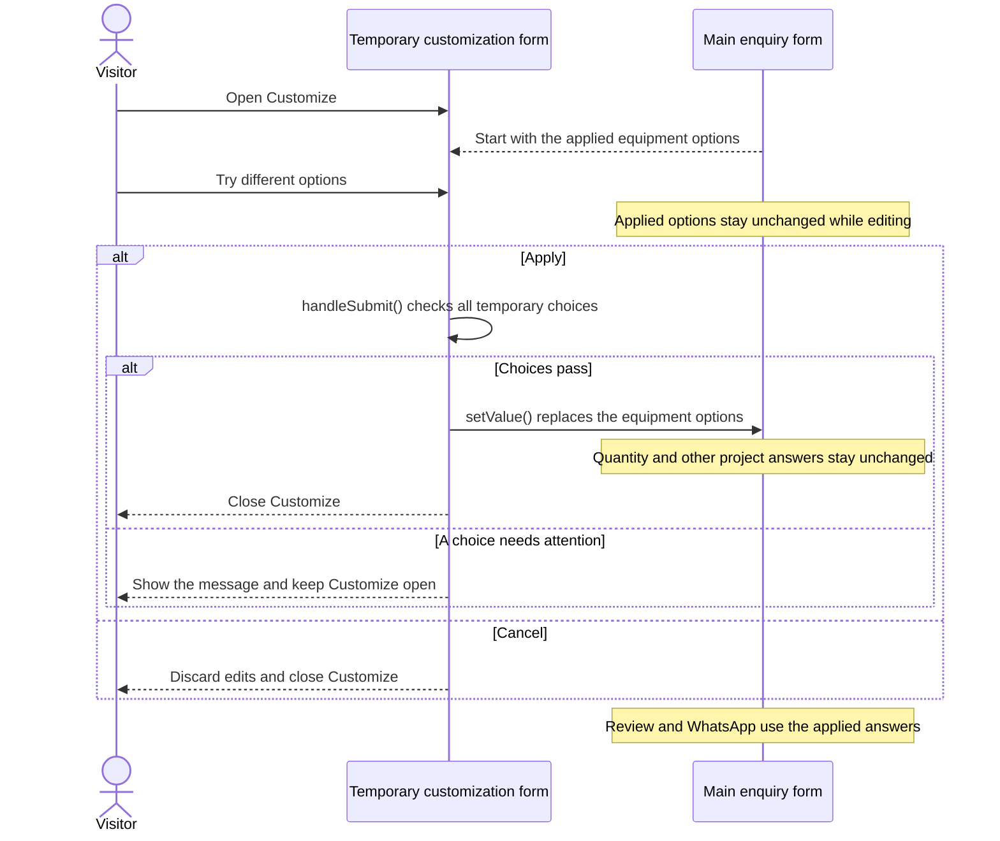

# React Hook Form in the equipment selector

This guide explains how the wizard keeps answers, checks them and lets visitors try equipment options before applying them. For the feature's purpose and development direction, see the [equipment README](features/equipment/README.md).

## Two forms with different jobs

The wizard has a main enquiry form and a temporary form for Customize. React Hook Form (RHF) manages them separately, although their controls share one HTML form.

|             | Main enquiry                                                  | Temporary customization                                          |
| ----------- | ------------------------------------------------------------- | ---------------------------------------------------------------- |
| Holds       | Equipment selection, applied options and project requirements | The equipment options currently being edited                     |
| Starts with | The answers prepared when the wizard opens                    | The options last applied to the selected machine                 |
| Lasts for   | The current wizard session                                    | One visit to Customize                                           |
| Main action | Continue checks answers before changing steps                 | Apply checks the temporary choices and saves them to the enquiry |

Each has its own `useForm()` instance. `FormProvider` and `useFormContext()` let the wizard's steps share the main form; reading that context does not create another form. The customization controls use the separate editor form.

## Continue checks progress

Continue checks the answers needed to move forward. It uses `trigger()` to request validation without submitting the enquiry through React Hook Form.

| Current step | What Continue checks                                                                |
| ------------ | ----------------------------------------------------------------------------------- |
| Equipment    | An equipment category has been selected                                             |
| Machine      | The machine belongs to that category and its requested options are supported        |
| Requirements | All relevant answers, including the equipment selection and any rental requirements |
| Review       | There is no further Continue action; the visitor can edit answers or open WhatsApp  |

The wizard checks the whole relevant enquiry before Review so an earlier answer cannot escape validation simply because its step is no longer visible. For a purchase, saved rental answers do not participate in that check.

A visitor can press Continue with incomplete answers to find out what needs attention. The wizard shows the relevant question and moves keyboard focus to it. Continue is unavailable while customization is open or a previous Continue check is still running.

Repeated Continue actions are ignored while a check is running. If the visitor navigates, changes equipment or opens Customize during that check, its old result cannot subsequently move them to another step.

## Customize tries changes before saving them

Customize starts with the currently applied equipment options. Edits stay in the temporary form until Apply succeeds.

1. **Apply** uses the editor's `handleSubmit()` to check all temporary choices. If they pass, `setValue()` replaces the enquiry's equipment options with the complete chosen set. Other answers stay as they were.
2. **Cancel**, changing equipment or leaving the step discards unfinished edits. Reopening Customize starts from the options currently applied to that machine.
3. **Invalid choices** keep the editor open with a message explaining the problem. They do not change the enquiry.

For example, a visitor requests two machines and tries a different power option. Apply saves the new power choice while keeping the quantity at two. Cancel keeps the previously applied power choice.

The forms do not combine their answers automatically. Apply is the explicit transfer from temporary choices to the main enquiry. It does not send anything to COMQ. Submitting the wizard's HTML form with Enter does not apply the draft; activating the Apply button runs the editor's separate handler.

Apply also updates the main form's understanding of the change:

| RHF option       | Purpose                                                                                  |
| ---------------- | ---------------------------------------------------------------------------------------- |
| `shouldDirty`    | Recheck whether the options differ from the answers present when the wizard first opened |
| `shouldTouch`    | Record that the visitor has interacted with and applied the options                      |
| `shouldValidate` | Request another check of the applied options in the main enquiry                         |

Here, “dirty” means different from the starting answer. Returning to that answer can clear that status. Saving with Apply does not change the starting point used for this comparison. The editor closes without waiting for the additional main-form check.

## Validation rules and error messages

A **resolver** connects our equipment rules to React Hook Form. The rules decide whether an answer is acceptable and provide a message in the selected language. RHF makes the relevant errors available to the interface; the wizard decides whether to stay on the current step or move elsewhere.

The rules can examine the complete enquiry, even when Continue requests a result for just one step. This matters when one answer depends on another, such as rental duration being required only for a rental.

The main form uses `onTouched`: a question is first checked when the visitor leaves it, then checked again as they edit it. Continue can also check questions that have not been left yet. It marks those questions as touched, allowing later corrections to refresh their messages immediately. Questions on later steps keep their usual timing.

For example:

1. A visitor changes quantity from one to 100 before that question has been checked. No error appears until they leave it or press Continue.
2. Leaving it or pressing Continue displays the message that quantity must be between one and 99.
3. Changing it to two clears the message without another Continue attempt.

`trigger()` keeps this behaviour during step navigation because it does not put the main form into RHF's submitted state. The editor's `handleSubmit()` belongs to its separate form and does not change the main form's validation mode.

Error messages appear beside the relevant question and are associated with its control for assistive technology. An error in a group of choices belongs to that group. A problem with the temporary equipment choices appears inside Customize. These messages belong to their respective forms; applying choices does not transfer the editor's errors into the enquiry.

The inputs display the errors they receive without adding another rule about when they should become visible. Timing belongs to validation. The wizard uses its translated messages for submission feedback instead of the browser's default validation popups.

## Keeping answers and handling changes

Back and Continue preserve answers within the current wizard session. React Hook Form's `shouldUnregister: false` keeps answers even when their controls are temporarily removed from view. A page reload or a language change starts a fresh enquiry; these answers are not saved for a later visit.

Changing machines resets the equipment options to the new machine's defaults while keeping quantity, purchase/rental preference and project details. Questions already checked are revalidated where necessary; unrelated or untouched questions do not suddenly gain errors.

Switching from rental to purchase hides rental questions and excludes those answers from validation and the enquiry summary. Switching back to rental restores the answers while the same wizard session continues.

Native inputs still need a few deliberate choices. An optional date can be left blank, but a partly entered date must be treated as unfinished rather than empty. Equipment extras are independent checkboxes, so choosing none is valid. Machine defaults shown to visitors are product information; they are separate from RHF's tracking of whether an answer has changed.

## Where React Hook Form helps

| API                              | Role in this flow                                                                                                                  |
| -------------------------------- | ---------------------------------------------------------------------------------------------------------------------------------- |
| `useForm`                        | Manage each form's answers and validation state                                                                                    |
| `FormProvider`, `useFormContext` | Let different parts of the wizard access the same main form                                                                        |
| `register`                       | Connect native inputs, selects and checkboxes to their form                                                                        |
| `Controller`                     | Connect the editor's option dropdowns where their values need adapting                                                             |
| `control`                        | Tell subscriptions and controlled fields which form they belong to                                                                 |
| `useWatch`                       | Update the interface when relevant answers change; its `compute` option prepares Review and WhatsApp content from the same answers |
| `getValues`                      | Read the current answers when handling an action                                                                                   |
| `useFormState`, `formState`      | Read errors, interaction history and whether Apply is in progress                                                                  |
| `setValues`                      | Update related answers together when equipment changes                                                                             |
| `setValue`                       | Save the validated temporary options into the main enquiry                                                                         |
| `trigger`                        | Check answers before navigation or after a dependent answer changes                                                                |
| `handleSubmit`                   | Validate the temporary form before applying its choices                                                                            |
| `getFieldState`, `setFocus`      | Identify a question needing attention and focus it once visible                                                                    |
| `resolver`                       | Connect equipment-specific rules and translated messages to form validation                                                        |
