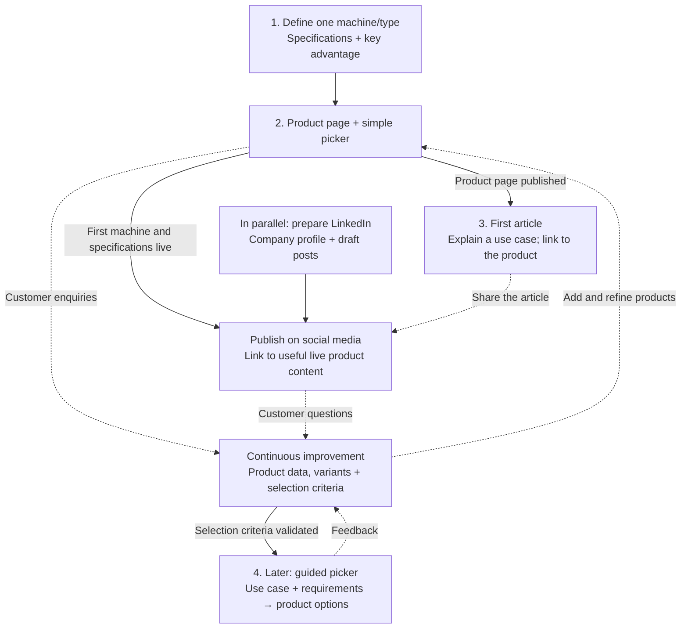

# Website content strategy

Turn COMQ's service overview into a useful starting point for equipment buyers: explain what is offered, why it fits their operation, and how to request a quote. Build the product content first, then use articles and LinkedIn to bring readers to it.

This is a planning document. Alberto will confirm the product range, specifications and commercial claims before they become website content.

For the short, prioritized request list, see [What we need from Alberto](alberto-first-inputs.md).

## Roadmap at a glance

**Start with one confirmed machine or equipment type and its specifications.** The catalogue develops continuously from that first entry.

Solid arrows show prerequisites. Dotted arrows show sharing and ongoing improvement. LinkedIn preparation can start immediately, but publishing social media posts waits until the first machine and its specifications are live on the website. The first article also needs a published product page. The guided picker depends on reliable product data and validated selection criteria, rather than a particular catalogue size.

## 1. Define the product offer and its differences

Develop the catalogue continuously, starting with at least one defined machine or equipment type and its confirmed specifications. Add products, models and variants as their information becomes available. The groups below come from the existing website; specific manufacturers, models and variants still need to be selected.

### Product comparison worksheet

Replace each group with one row per selected model or variant. Record the actual specification values, units and source alongside the product information.

| Product group       | Specifications to collect                            | Difference to establish                     | Supporting information                  |
| ------------------- | ---------------------------------------------------- | ------------------------------------------- | --------------------------------------- |
| Jumbos              | Application, dimensions, drilling configuration      | Best reason to choose this model            | Technical sheet; comparable alternative |
| Scooptrams          | Capacity, dimensions, power configuration            | Best reason to choose this model            | Technical sheet; comparable alternative |
| Other drilling rigs | Application, configuration, operating requirements   | Distinction from the other drilling options | Technical sheet; comparable alternative |
| Spare parts         | Part number, compatible models, original/aftermarket | Reason to choose this supply option         | Compatibility details; supply terms     |

For each selected product, answer:

1. **Who is it for?** Describe the buyer, application and target market.
2. **What matters most?** Identify the specifications that affect that buyer's decision.
3. **How does it differ?** Compare it with a relevant alternative using the same application, units and scope. Record the alternative and the source/date of the comparison.
4. **Why buy through COMQ?** Separate the machine's advantages from COMQ's offer, such as advice, availability or service scope, once confirmed.
5. **What should stand out?** Choose the strongest one or two supported advantages. Explain their practical benefit prominently beside the product introduction, then put the detail in the specification table.

Collect a product name, manufacturer/model, variant, photos, technical sheet, condition, sales/rental availability and quote requirements. Confirm lead times, delivery destinations, warranty and service scope for the actual offer. Treat existing broad website claims about stock, immediate delivery and maintenance as copy to check against those details.

**First milestone:** one defined machine or equipment type with confirmed specifications and a first entry in the worksheet. Expand the table continuously as Alberto confirms more products and their competitive advantages.

## 2. Organize products around their use

Use a shared set of application categories for the catalogue, future picker and articles. Validate this initial grouping with Alberto:

| Customer's task                 | Product group to explore       | Question to clarify                               |
| ------------------------------- | ------------------------------ | ------------------------------------------------- |
| Underground drilling            | Jumbos and other drilling rigs | What drilling application is required?            |
| Loading and moving material     | Scooptrams                     | What capacity and access requirements apply?      |
| Maintaining an existing machine | Spare parts                    | Which model, serial number and part are involved? |

Refine these categories when the selected products are known. Keep purchase and rental as ways to obtain equipment, so the same machine information can support either offer.

An article can later follow the same story: **operational need → important requirements → options and trade-offs → relevant product → enquiry**.

## 3. First website stage: a product and specification picker

The first product page and simple picker can start as soon as one machine or equipment type and its specifications are defined. Expand them alongside the growing catalogue:

1. Choose an equipment category.
2. Select a product and, where available, its variant.
3. View photos, key specifications and the main differentiating benefits.
4. Compare the relevant specifications when multiple comparable products are available.
5. Request a quote with the selected model, variant and requirements included.

Give each product a dedicated, directly linkable page so readers can reach it from search, an article or LinkedIn. Keep the useful product information accessible without completing the picker. Use the same product records for selection, comparison and detail pages.

Publish matching Spanish and English content. Keep company purpose and Alberto's biography on their existing pages, with contextual links from product content where helpful.

**Ready when:** a visitor can identify an offered product, understand its main differences and send an informed enquiry.

## 4. Later website stage: a use-case-driven picker

Once the catalogue and selection criteria are established, let visitors start with their operation instead of a model name:

1. Identify the task or use case.
2. Collect the relevant operating requirements, including mine scale, access constraints and required capacity where applicable.
3. Show suitable product options and explain which stated requirements they match.
4. Compare machine versions and variants, including relevant trade-offs.
5. Send the selected options and operating requirements to COMQ for confirmation.

Alberto should define which inputs matter for each category and how those inputs relate to the specifications. Mine size alone should not determine the machine. When information is incomplete, let the visitor request advice rather than presenting a definitive match.

**Dependency:** confirmed model/variant data, documented selection criteria and review of representative enquiries with Alberto.

## 5. Establish COMQ's LinkedIn presence

### Dedicated company page

Create a COMQ LinkedIn company page with the company identity, logo, website, location, offer and a concise description of its purpose. Keep it distinct from Alberto's personal profile; his professional background can support the company story.

Once the company page exists, decide where the website should link to it. Keep Alberto's profile link in his biography. Record the confirmed company-page URL before changing the general social link.

### Website introduction post

**Publish on social media only once the first machine page is live with its specifications.** This gives the audience something concrete and useful to explore. Prepare the company profile and draft posts while the product content is being developed.

Prepare a short post with this structure:

1. The customer need COMQ wants to address.
2. The company's purpose and confirmed offer.
3. The first machine, its intended use and its main benefit.
4. An invitation to view the machine details or discuss a requirement.

Link to the live machine page and choose one clear visual. Mention product selection or article features when they are available. Confirm the initial publishing language; prepare the corresponding Spanish or English version as needed.

## 6. Add an article section to the website

Create a distinct article/blog view with an overview and individual article pages. Each article should explain one useful topic and link naturally to a relevant product page.

**Proposed first topic:** “What information should you gather before choosing underground mining equipment?” Narrow it to the first confirmed product category before drafting, so it can include a concrete example and a useful product link.

Suggested article outline:

1. Describe a recognizable operating need.
2. Explain the requirements that matter for that application.
3. Show how to read and compare the relevant specifications.
4. Discuss the important trade-offs using a confirmed product example.
5. Link to that product and invite the reader to discuss their requirements.

Have Alberto review the technical explanation. Include an author, publication date and technical sources where used, then prepare both language versions. Use a short LinkedIn post to introduce the article and link back to it.

**Ready when:** the article helps a buyer understand a decision and its product link leads to useful, published information.

## Keep the process moving

Start the next content discussion with Alberto by selecting the target buyers, the first models to feature and the single strongest reason to choose each offer. Use the questions received through enquiries to decide which specifications, comparisons and article topics to explain next.
